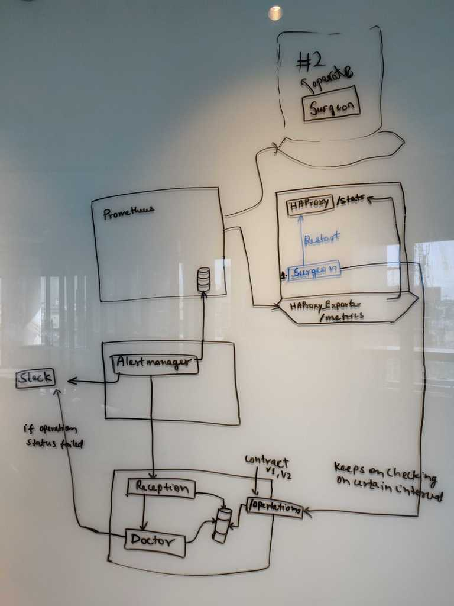

# Hospital

## Table of contents

  - [Introduction](#Introduction)
  - [Motivation](#Motivation)
  - [Components](#Components)
  - [Working Overview](#Working-Overview)
  - [Technical Specs](#Technical-Specs)

## Introduction

Hospital is an autonomous healing system for any System. Any failure or faults occurred in the system will be resolved automatically according to given run-book by the Hospital without manual intervention.

## Motivation

Let's say you've a server with load balancer (HAProxy) and clients are having timeouts for their request. In the presence of lots of request at same time load balancer will keep these requests in queue. But after requests timeout there in no sense to keep those requests in queue. After a certain limit you may want to reset the queue. Each time you reset the queue using some run-book. Why not automate this instead of doing it manually. *Making devs' lives easier.*

## Components

* A VM to be Healed
* Monitoring Agent
* Alert Manager
* **Hospital**
* *Surgeon*
  

## Working Overview

On any VM, services will expose it's metrics. A Monitoring (Prometheus) agent will scrap those metrics and will store in its Database. User will have to define rule for alerting. Based on those rules *Alert Manager* will sent alerts to **Hospital**. Now Hospital looks in the Run-book Mapping corresponding to that alert and puts operations in it's Database. *Surgeons* will be siting on each VM with an unique ID and can run script. Each Surgeon will do long polling to the Hospital. Hospital will look into it's Database for operations corresponding to surgeon ID and respond with operations. Surgeon will apply all operations and will notify back to the Hospital with it's status and Logs. Now based on status and logs the Hospital will send message to slack about the Fix.

## Technical Specs

* Prometheus (Monitoring Agent)
* Alert Manager with web-hook to Hospital Api
* A server for deploying **Hospital**
* *Surgeon* on each system able to poll *Hospital* and run script on on that system.
